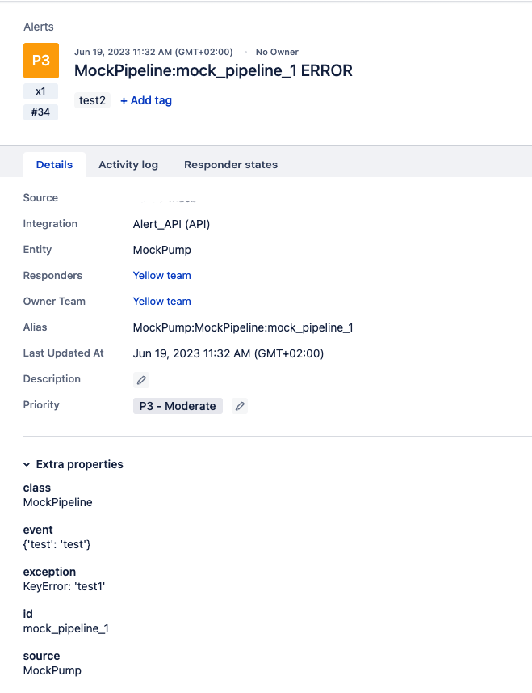

# Alerting via OpsGenie
- When you want to send an alert every time when an error occurs in your pipeline, you can use this alerting service.

## Prerequisites
- You need to have an OpsGenie account. If you don't have one, you can create a free account at [OpsGenie](https://www.opsgenie.com/).
- You need to have an API key. You can create an API key in your OpsGenie account with this tutorial [OpsGenie API](https://support.atlassian.com/opsgenie/docs/create-a-default-api-integration/).

## Configuration
```
# For OpsGenie
[asab:alert:opsgenie]
api_key=<api key>
tags=<tags> #optional

# If you want to configure alert_id otherwise there will be a random UUID generated
[pipeline:MockPipeline]
alert_id=mock_pipeline_1
```

## Alert example
